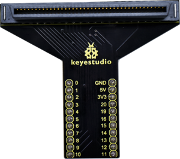
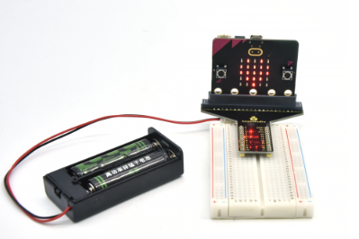
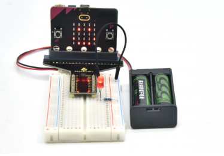

# KS4016 Keyestudio Micro: bit T-type Shield V2.0 Adapter(Black and Eco-friendly)

## 1. Description

The BBC micro: bit is a powerful handheld, fully programmable, computer designed by the BBC. It was designed to encourage children to get actively involved in technical activities, like coding and electronics.

It supports the PXT graphical programming interface developed by Microsoft and can be used under Windows, MacOS, IOS, Android and many other operating systems without additional download of the compiler.

Looking to do more with your BBC micro: bit? Unlock its potential with this T-type breakout board for the BBC micro: bit!

The edge connector/header offers a DC circuit which can boost voltage and output 3.3V and 5V.

It provides access to all of the BBC micro: bit processor pins allowing a lot of extra functionality to be added. The micro: bit development board should be inserted firmly into the edge connector of this breakout board. Then you can directly plugged the board onto the breadboard.

## 2. Wiring Up

